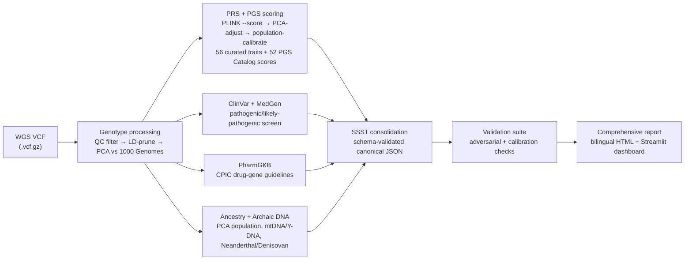

<p align="center">
  
</p>

# 🧬 BlueGen

**Personal Genomics Platform** — Powered by the PRSKit polygenic risk score engine.

[](https://www.python.org/)
[](LICENSE)
[]()
[]()

Turn a WGS VCF (GRCh37 or GRCh38, detected automatically) or a consumer genotyping-array export into a comprehensive personal genomics report: polygenic risk scores, pathogenic variants, pharmacogenomics, ancestry, and wellness traits — all offline, all free.

## 🚀 Quick Start

```bash
git clone https://github.com/danielperez9430/BlueGen.git
cd BlueGen
python3 -m venv venv && source venv/bin/activate
pip install -e .            # deps + the `bluegen` command (== python prs.py)

# Recommended: download the genome-wide 1000G reference first (~25 GB, one-time).
# Without it, the pipeline silently falls back to a chr22-only reference for
# PCA/ancestry/LD pruning (see IMPROVEMENT_PLAN.md TIER 0.2).
python3 prs_research_pipeline/scripts/setup/download_1000G_full.py

# Full analysis (WGS VCF, GRCh37 or GRCh38)
python3 prs.py run --full --vcf your_sample.vcf.gz

# … or from a genotyping-array export (23andMe / AncestryDNA / MyHeritage / FTDNA)
python3 prs.py run --full --raw genome_John_Doe_v5_Full.txt

# Interactive dashboard
pip install -e ".[dashboard]" && venv/bin/streamlit run dashboard.py
```

## 📊 What It Does

| Module | Description | Data Source |
|--------|-------------|-------------|
| 🧬 **PRS Engine** | ~56 traits, 206 SNP rows (187 unique rsIDs), scored jointly with the 1000G reference on one variant set and z-scored against your inferred super-population; every citation audited against PubMed | Curated GWAS + 1000 Genomes |
| 🔬 **ClinVar** | Pathogenic/likely pathogenic variants with confidence tiers | NCBI ClinVar (4.4M records) |
| 💊 **PharmGKB** | Drug-gene interactions, CPIC guideline recommendations | CPIC/DPWG (218 guidelines) |
| 🌍 **Ancestry** | PCA + mtDNA/Y-DNA haplogroups + sub-continental | 1000 Genomes (26 populations) |
| 🦴 **Archaic DNA** | Neanderthal/Denisovan admixture via AADR direct comparison | Allen Ancient DNA Resource (1.23M SNPs) |
| 🩺 **PGS Catalog** | 52/57 scored jointly with the 1000G reference on one variant set and calibrated against your inferred super-population (z-score + percentile + coverage); a handful excluded for being genome-wide-scale (>500K variants) | PGS Catalog (EBI) |
| 📖 **MedGen** | Disease definitions for ClinVar findings | NCBI MedGen (23K concepts) |
| 📊 **Dashboard** | 9-page interactive Streamlit app (PRS, recommendations, PGS Catalog, ClinVar, PharmGKB, ancestry, archaic DNA) | All JSON/CSV outputs |

## 🏗️ Architecture



Everything above runs locally — no genetic data ever leaves the machine.

## 📁 Documentation

Full docs: [`prs_research_pipeline/README.md`](prs_research_pipeline/README.md)

Quick reference: [`USAGE.md`](USAGE.md)

Changelog: [`CHANGELOG.md`](CHANGELOG.md)

Data sources & attribution: [`SOURCES.md`](SOURCES.md)

## 🔧 Requirements

- **Python 3.10+** — `pip install -r prs_research_pipeline/requirements.txt`
- **PLINK v1.90b7.2+** — [Download](https://www.cog-genomics.org/plink/) (free, GPLv3)
- **PLINK 2.0** — [Download](https://www.cog-genomics.org/plink/2.0/) (optional, for advanced QC)
- **bcftools + tabix** — `brew install bcftools tabix` (macOS) or `apt install bcftools tabix` (Linux)
- **BWA** — `brew install bwa` (macOS) or `apt install bwa` (Linux) (optional, for FASTQ → BAM alignment)
- macOS/Linux (Windows via WSL2)
- ~200 MB reference data (auto-downloaded on first run)
- ~65 GB reference data bundle (optional — from [archive.org](https://archive.org/details/bluegen-reference-data) snapshot or `prs_research_pipeline/scripts/setup/` to fetch latest from public sources)
  - [`bluegen-reference-data`](https://archive.org/details/bluegen-reference-data) — 1000 Genomes, hg19, ClinVar, MedGen, ClinPGx
  - [`bluegen-pgs-cache`](https://archive.org/details/bluegen-pgs-cache) — 56 PGS Catalog scoring files
  - [`bluegen-archaic-reference`](https://archive.org/details/bluegen-archaic-reference) — AADR 1240K archaic panel (Neanderthal + Denisovan), pre-converted to PLINK
  - [`bluegen-vindija-reference`](https://archive.org/details/bluegen-vindija-reference) — Vindija Neanderthal genome VCFs (chr1–22, hg19, ~44 GB)
  - > **Maintainer:** `python archive_upload.py -j 8` to refresh snapshots

### Docker (no PLINK / system-lib setup)

The image bundles Python deps, PLINK 1.9, bcftools/tabix and the WeasyPrint libs (PLINK 2.0 too on amd64). Reference data and outputs are bind-mounted, never baked in.

```bash
docker build -t bluegen .
docker run --rm \
  -v "$PWD/prs_research_pipeline/reference:/app/prs_research_pipeline/reference" \
  -v "$PWD/prs_research_pipeline/reports:/app/prs_research_pipeline/reports" \
  -v "/path/to/sample.vcf.gz:/data/sample.vcf.gz:ro" \
  bluegen run --full --vcf /data/sample.vcf.gz
```

The image is multi-arch and builds **natively on both amd64 and arm64** (Apple Silicon included, no emulation): cog-genomics ships no Linux ARM64 PLINK, so PLINK 1.9 (`1.90b7.7`) and bcftools/tabix are installed from bioconda with the same pinned versions on both architectures. PLINK 2.0 has no ARM64 Linux build anywhere and is only added on amd64; the pipeline never calls it. To keep every intermediate output (`plink/`, `qc/`, `prs/`, …) on the host, mount the whole `prs_research_pipeline/` directory instead of the two subfolders above.

### System Tools

PLINK is **not bundled** in the git clone (it is in the Docker image) — download the correct build for your OS:

| Tool | Version | macOS (Apple Silicon) | macOS (Intel) | Linux |
|------|---------|----------------------|---------------|-------|
| PLINK 1.9 | [v1.90b7.2](https://www.cog-genomics.org/plink/) | `plink` (universal binary, runs natively on arm64) | `plink_mac` | `plink_linux` |
| PLINK 2.0 | [v2.0.0-a.7.1](https://www.cog-genomics.org/plink/2.0/) | `plink2_mac_arm64` | `plink2_mac` | `plink2_linux` |

Place the binaries in your `PATH` or symlink them into the project root.

## 📄 License

The **code** of this project is released under the [MIT License](LICENSE).

The **data files** under `prs_research_pipeline/reference/` and `prs_research_pipeline/data/` retain the licenses of their original providers (see [`SOURCES.md`](SOURCES.md)). In particular, `reference/clinpgx/` and files derived from it are PharmGKB/ClinPGx data licensed under [CC BY-SA 4.0](https://creativecommons.org/licenses/by-sa/4.0/) — they are redistributed here with attribution and remain under that license, not MIT. All other bundled reference data (ClinVar, MedGen, 1000 Genomes, AADR, etc.) is public domain / CC0 / open access.

## ⚠️ Disclaimer

**RESEARCH USE ONLY — NOT FOR CLINICAL DIAGNOSIS.** This platform is for research and educational purposes. Clinical decisions should not be based on its output without confirmation by a certified laboratory.
